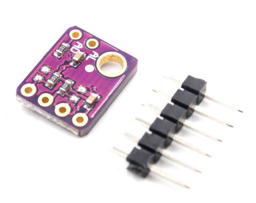

# SHT31-TemperatureHumidityLCD-Display
SHT31 Temperature Humidity Sensor Display to LCD

아두이노의 온습도 센서중에서 가장 많이 쓰는 것은 파란색 박스의 DHT11, 그리고 하얀색 박스의 DHT22 그리고 DHT31 이라는 것이 있다. 가격은 DHT11 이 가장 저렴하고, DHT22 가 그다음, DHT31 이 가장 비싼것으로 되어 있다. 물론 정밀도도 DHT11 이 가장 떨어지고, DHT31 이 가장 높다.

The most commonly used temperature and humidity sensors of Arduino are DHT11 in blue box and DHT22 and DHT31 in white box. The price of DHT11 is the cheapest, DHT22 is the next, DHT31 is the most expensive. Of course, DHT11 has the lowest precision and DHT31 has the highest accuracy

DHT11 이나 DHT22 는 디지털 입력 PIN 을 사용하므로, LCD 를 사용하는데 불편함이 없었으나, DHT31 은 i2c 버스를 이용하므로, LCD 와 병렬로 연결되어야 한다.

Since the DHT11 or DHT22 uses the digital input PIN, it is not inconvenient to use the LCD, but the DHT31 uses the i2c bus, so it must be connected in parallel with the LCD.

센서와 디스플레이가 서로 충돌하지 않을까 하는 우려가 있었으나, 그대로 병렬로 연결했을때 아래의 소오스로 잘 동작했다.

There was a concern that the sensor and the display might collide with each other. However, when connected in parallel, it worked well with the following sources.

당연하지만, 그래도 막상 의구심이 들었을 때 예제를 찾기가 힘들어서, 좀 헤메였는데, 혹시 필요한 분이 있지 않을까 해서 올림.

Of course, it was hard to find an example when I was skeptical, but I was a bit nervous.

Connection

<pre>
SHT31 (SCL) -------+-----------> A5 (Arduino) 
                   +-------------------------------------- LCD (SCL)
SHT31 (SLDA) -------------+----> A4 (Arduino) 
                          +------------------------------ LCD (SDA)

</pre>
